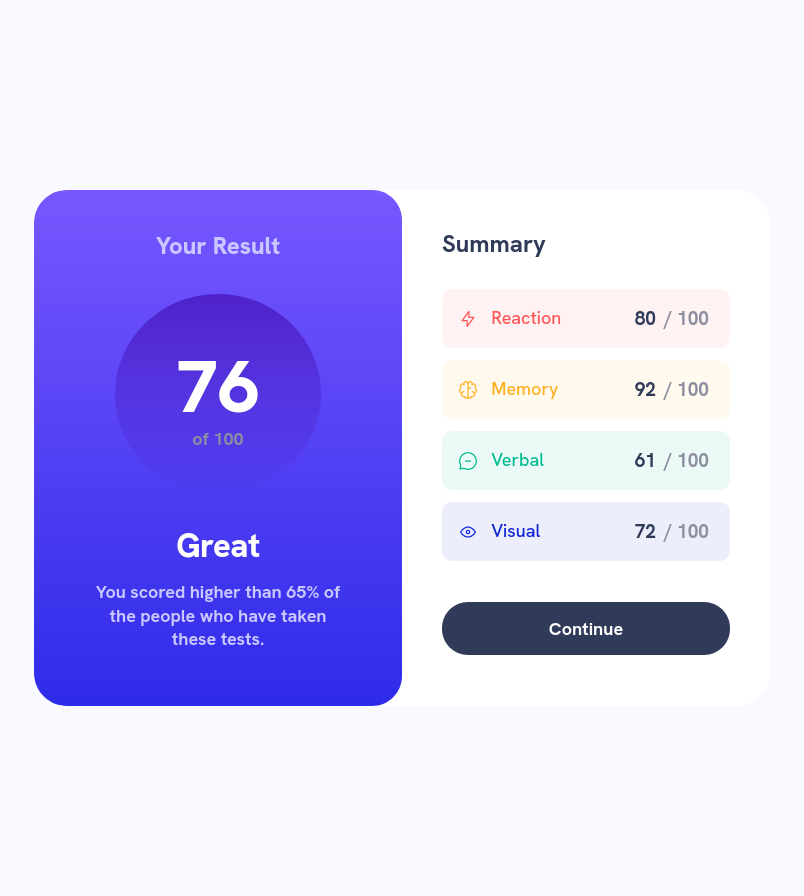

# Frontend Mentor - Results summary component solution

This is a solution to the [Results summary component challenge on Frontend Mentor](https://www.frontendmentor.io/challenges/results-summary-component-CE_K6s0maV). Frontend Mentor challenges help you improve your coding skills by building realistic projects. 

## Table of contents

- [Overview](#overview)
  - [The challenge](#the-challenge)
  - [Screenshots](#screenshots)
  - [Links](#links)
- [My process](#my-process)
  - [Built with](#built-with)
  - [What I learned](#what-i-learned)
  - [Continued development](#continued-development)
  - [Useful resources](#useful-resources)
- [Author](#author)
- [Acknowledgments](#acknowledgments)

## Overview

### The challenge

Users should be able to:

- View the optimal layout for the interface depending on their device's screen size
- See hover and focus states for all interactive elements on the page

### Screenshot




### Links

- Solution URL: [https://github.com/harnettd/results-summary-component](https://github.com/harnettd/results-summary-component)
- Live Site URL: [https://harnettd.github.io/results-summary-component/](https://harnettd.github.io/results-summary-component/)

## My process

### Built with

- HTML5
- CSS with Flexbox, BEM methodology, and Sass
- Javascript and JQuery

### What I learned

In completing this project, I learned how to

- apply a color gradient as a `background-image`
- use hsla to specify colors and opacity
- minimize CSS (although it was hardly necessary for such a small project)
- use JQuery to select HTML elements and change their text and attributes, _i.e.,_

```javascript
for (let row = 0; row <= 3; row++) {
    $(`.summary-card__img--${row}`).attr("src", data[row].icon)
    $(`.summary-card__category--${row}`).text(data[row].category)
    $(`.summary-card__grade--${row}`).text(data[row].score)
}
```
### Continued development

- Since I learned how to minimize CSS, I should probably learn how to minimize Javascript as well.
- While I do appreciate BEM methodology for how it helps me organize my CSS thinking and code, using BEM does produce a lot of files and directories compared to simply putting all of my CSS into a single styles.css file. This necessitates the project having a build step. On this (and my previous) project, I used Make for building. On my next project, I plan to use Gulp for building.
- Reading in a local JSON file was surprisingly difficult. In the end, I edited the data.json file so that it defined data to be a list of objects. Then, I loaded the file in index.html using a script tag. But to do this, I needed to be able to edit data.json which won't always be the case. So, what's the best way to read a local JSON file?

### Useful resources

- [W3Schools HTML HSL and HSLA Colors](https://www.w3schools.com/html/html_colors_hsl.asp) - This W3S page explains the H, S, L, and A from hsla and has several demos with sliders that let you see the effects of changing each of the values.
- [Learn Makefiles](https://makefiletutorial.com/) - I hadn't written a Makefile in a while. This webpage served as an excellent refresher.
- [JQuery API Documentation](https://api.jquery.com/) - This is the official JQuery documentation site. It's fairly easy to read and contains many code snippets.

## Author

- Github - [Derek Harnett](https://github.com/harnettd)
- Frontend Mentor - [@harnettd](https://www.frontendmentor.io/profile/harnettd)

## Acknowledgments

- Thanks to [Frontend Mentor](https://www.frontendmentor.io/) for posting this challenge.
